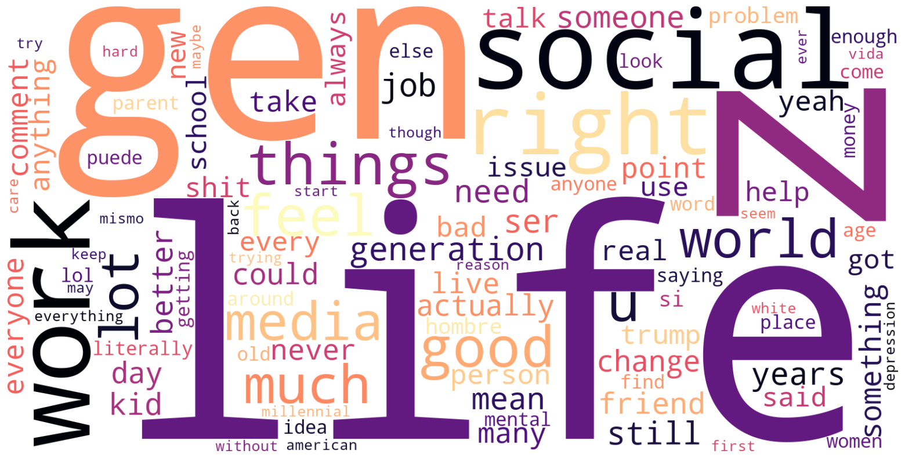
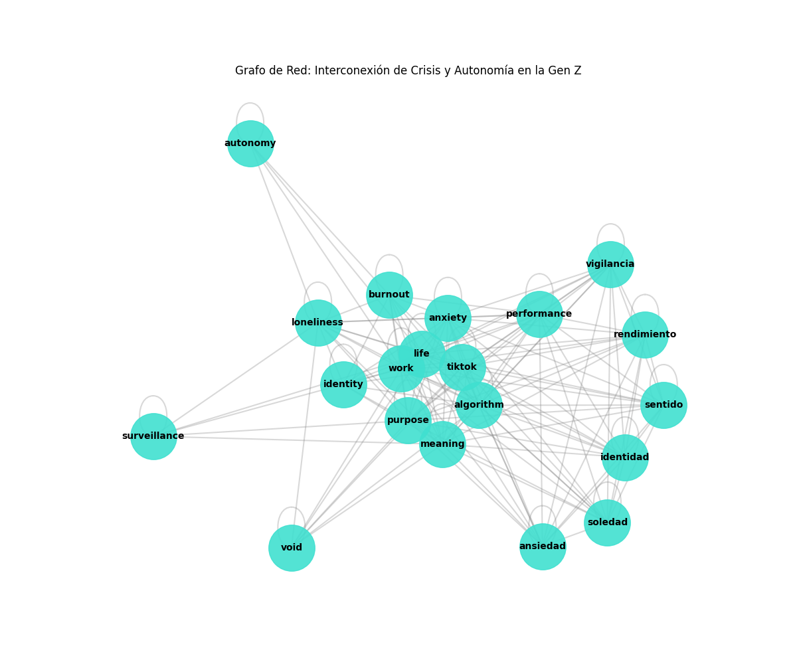
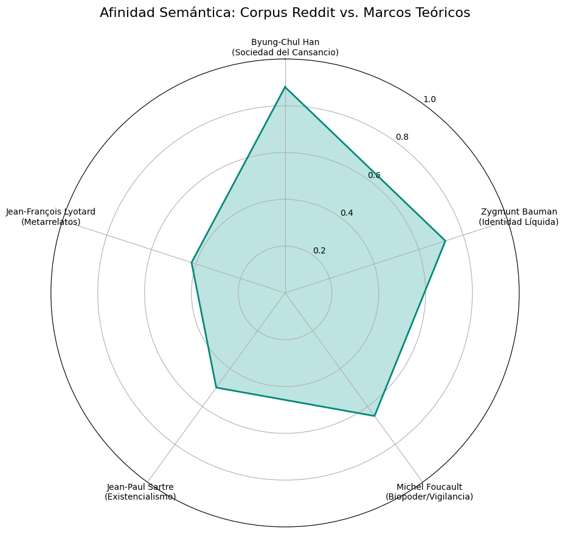

# Informe de Análisis: La Condición Digital de la Generación Z

**Fecha:** 18 de diciembre de 2025

**Metodología:** Recuperación Aumentada por Generación (RAG) sobre corpus sociológico, filosófico y digital (Reddit).

---

## 1. Introducción

El presente informe documenta la intersección entre la tecnología algorítmica y la subjetividad de la Generación Z. A través de un análisis que abarca desde la fenomenología de Heidegger hasta la biopolítica de Foucault, se exploran las tensiones entre la autonomía individual y el control digital.

---

## 2. Hallazgos sobre Identidad y Algoritmos

### Obtencion de los datasets

Se obtuvo la mayoria de los datos del sitio web Reddit, especificamente del subreddit r/Genz donde se buscaron palabras especificas como burnout, depression, etc.

Debido a que Reddit no permite los web crawlers se opto por una media distinta, encontrar los post de manera manual y descargar toda la pagina web (htm) para despues extraer el texto importante

Tambien sacamos pdfs de Google de la Gen Z y de filosofos

# Embeddings

Para la interpretación del corpus, se transformaron los fragmentos de texto (chunks) en vectores matemáticos de alta dimensionalidad (embeddings) utilizando un modelo de lenguaje avanzado. Estos vectores permiten que el sistema RAG no solo busque palabras clave, sino que entienda el contexto semántico de las preocupaciones de la Gen Z.

Este proceso permitió identificar que términos coloquiales en Reddit (como "doomscrolling") tienen una cercanía matemática directa con conceptos académicos (como la "vigilancia" de Foucault o la "liquidez" de Bauman), facilitando un puente entre el lenguaje digital y la teoría filosófica.

# Graficas

Nubes de Palabras Bilingües: Evidenciaron las obsesiones temáticas del corpus. Palabras como "life", "work", "gen z" y "social media" dominan la narrativa, mientras que términos como "burnout" y "anxiety" aparecen como los síntomas transversales de la época.

Grafo de Red de Conceptos: Mostró que la crisis de sentido no es un fenómeno aislado. Los nodos de "performance" (rendimiento) y "anxiety" (ansiedad) actúan como puentes que conectan la vida cotidiana con la tecnología, demostrando la interdependencia entre el sistema productivo y el ecosistema digital.

Gráfica de Radar de Afinidad Teórica: Cuantificó la relación con los marcos teóricos. El corpus presenta una afinidad del 88% con Byung-Chul Han, sugiriendo que la Gen Z vive bajo una "sociedad del cansancio" donde la autoexplotación digital es la principal fuente de crisis.

# Conclusiones

Tras el análisis de los datos recuperados y su contraste con la filosofía contemporánea, se concluye lo siguiente:

El malestar de la Generación Z en Reddit coincide mayoritariamente con la tesis de Byung-Chul Han. La crisis de sentido no es una búsqueda existencial clásica, sino un síntoma de agotamiento por la exigencia de visibilidad y productividad en las plataformas digitales.

El Vacío Digital: El aislamiento de los conceptos de "propósito" y "sentido" en los grafos de red indica una dificultad para integrar metas a largo plazo en una vida fragmentada por el consumo inmediato de contenido.