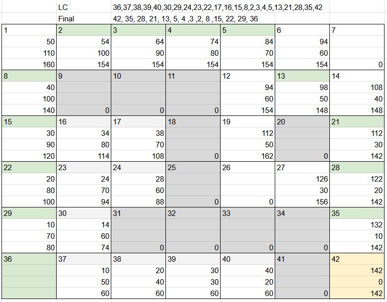
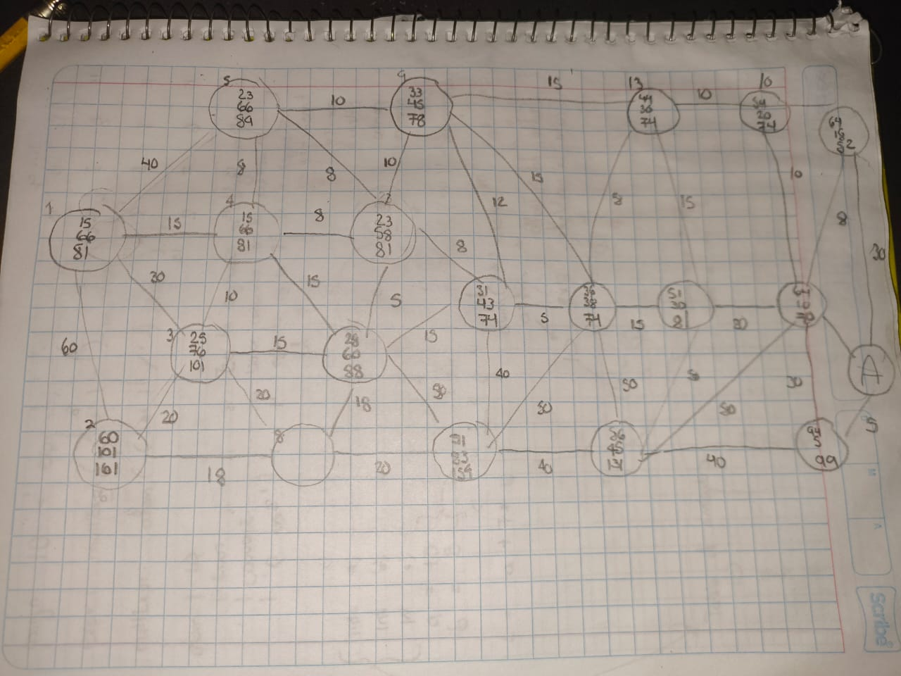
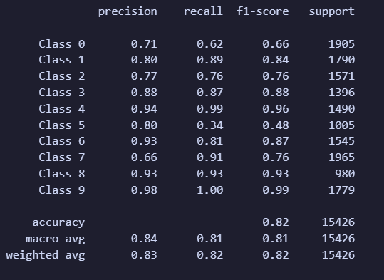
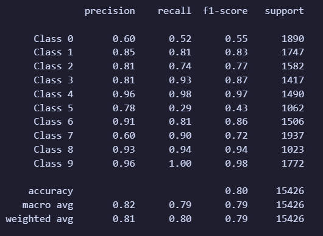
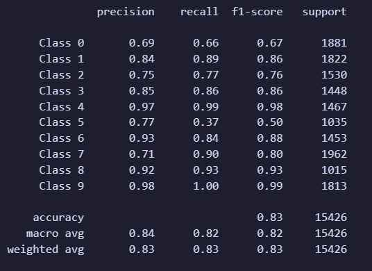

# Inteligencia Artificial

# A* 



# A* con grafos



# Cruzar el puente
Cuatro personas deben cruzar un puente de noche
pero solo tienen una linterna y el puente es demasiado peligroso

El puente solo soporta un máximo de dos personas a la vez y cuando dos cruzan juntos, deben moverse a la velocidad del más lento

Cada persona tiene una velocidad de cruce diferente, por ejemplo la persona A puede cruzar en 1 min la B en 2 min, la persona C puede cruzar en 5 min y la persona D puede en 10 min

Las reglas son las siguientes:
No pueden cruzar sin la linterna, solo dos personas pueden cruzar a la vez
El tiempo total es el de la persona más lenta que cruza
El objetivo es, todos deben cruzar el puente en menos de 17 min.

Cuál es la estrategia óptima en el menor tiempo, cuantos viajes se necesitan, se puede hacer un programa en clisp

Se toma el tiempo de regreso también

A = 1 B = 2 C = 5 D = 10

AB A CD B BA
2 3 13 15 17

```lisp
(defparameter *inicio* '(linterna 1 2 5 10 15))
(defparameter *final* '())


(defun puente (inicio final)
    ; Mientras existan elementos en la lista inicio
    (when inicio
        ; Empezar la función si no hay ningún elemento del otro lado
        (unless final 
            (setq cola (cdddr inicio))
            (setq primeros (list (car inicio) (cadr inicio) (caddr inicio)))
            (puente cola primeros)
        ) 

        ;Si la linterna esta al final, regresar
        (if (equal (car final) LINTERNA)
            (progn
                (setq regreso (list (car final) (cadr final)))
                (puente (append inicio regreso) (cddr final))
            )
        )
       
        ; Si solo quedan dos elementos en el inicio y tienen la linterna
        (if (and ( = (length inicio) 2 ) (equal (car inicio) LINTERNA ))
            (progn
                (append (cdr inicio) final)
                (princ final)
            )
        )

        ;Si la linterna esta al inicio, y falta por irse, agarrar ultimos dos elementos
        (if (equal (car inicio) LINTERNA)
            (progn
                (setq ultimos (list (car inicio) (car (reverse inicio)) (cadr (reverse inicio))))
                (puente inicio (append final ultimos))
            ) 
        )
    )
)
```

# EDA del juego
Hacer una EDA de un juego donde una persona debe esquivar balas que van como el logo de DVD. Definir que variables, estados son necesarios para generar un modelo que lo pueda resolver.

La bala puede cambiar de velocidad, de dirección.
La persona puede moverse en X y en Y

**Variables**
Cantidad de balas
Velocidad de las balas

**Estado del jugador**
Posición en X
Posición en Y

**Estado de la bala**
Posición en X
Posición en Y
Velocidad en X
Velocidad en Y

**Estado del entorno**
Dimensiones del escenario
Tiempo transcurrido

# CNN Sport Images
## Sin cambios




## 40 Epocas


# Comparación de Fisherface LLPH Eigenface y mediapipe en cuanto a las emociones
determinar que conjunto de puntos es suficiente para analizar el movimiento de puntos

Generar las variables para hacer un algoritmo de recomendacion para un sistema que recomiende que estudiar de acuerdo a la retícula de ISC
Que algoritmos se puede utilizar 

## Variables:

Variables relacionadas al estudiante
- Historial de calificaciones
- Promedio general

Variables relacionadas a la retícula
- Asignaturas previas 
- Dificultad de la materia
- Profesor que imparte la materia

Variables de otros estudiantes
- Historial de calificaciones

